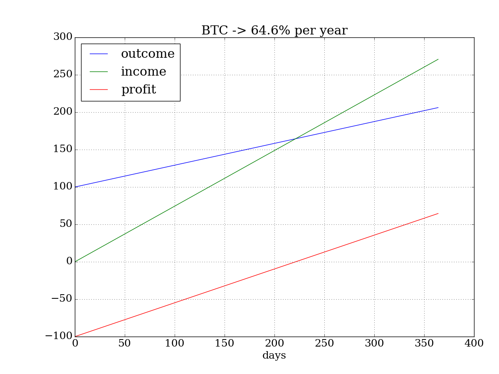
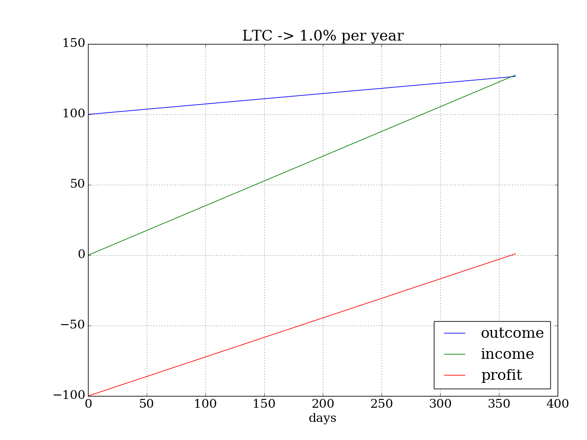
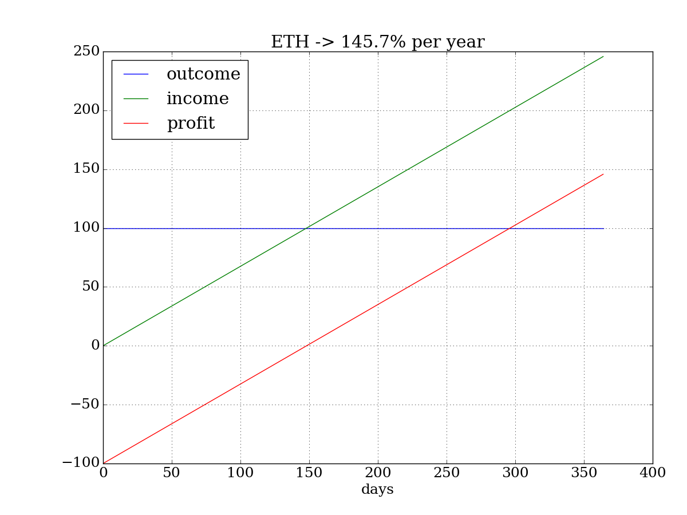

# mining-calc

## Profit estimation for cloud mining

Is it cloud mining profitable? Let's investigate what services are proposed now.

I consider 3 quite popular cryptocurrencies: Bitcoin, Litecoin and Ethereum. Coins exchange average rates for May, 28 2017 from [coinmarketcap](http://coinmarketcap.com/api/) API:
```
BTC: 2115.14 USD 
LTC: 0.0107494 BTC
ETH: 0.0764511 BTC
```

Cloud mining proposal consists of the mining cost and maintenance fee for offered hash rate power. I've took the mining price list from hashflare.io and the rewards per offered rate from online calculator:   

```
# Bitcoin
SHA256 = { # https://alloscomp.com/bitcoin/calculator
    "MINE" : 1.2,          # USD per 10GH/s hash rate
    "MAINT" : 0.0035,      # USD fee per 10GH/s per day
    "COINS" : 422 * 1e-8,  # 422 satoshi per day for 10GH/s
}

# Litecoin
SCRYPT = { # http://www.coinwarz.com/calculators/litecoin-mining-calculator/
    "MINE" : 13.5,     # USD per 1 MH/s
    "MAINT" : 0.01,    # USD fee per 1 MH/s per day
    "COINS" : 0.002087,  # LTC coins per mine rate (~2495 satoshi per day)
}

# Ethereum
ETH = { # https://etherscan.io/ether-mining-calculator
    "MINE" : 2.2,      # USD per 100 KH/s
    "MAINT" : 0,       # maintenance
    "COINS" : 9.185 * 1e-5, # ETH coins (~690 satosi per day)
}
```

Below is shown calculation graph examples for 100 USD investment for each of considerate currency. The "outcome" line presets our expenses growth per day from 100 USD initial payment for hash rate power. Our revenue presented by "income" line. The "profit" line is the difference between "income" and "outcome". Since the cost for mined coins are higher than maintenance fee, the income is increasing faster that outcome. When income line cross outcome line, the profit changed to positive - it is a point of investment return.



The investments in BTC (SHA-256) mining will return in 222 days. Annual profit is 64.6%.



The investments in LTC (Scrypt) mining will return in 361 days. Annual profit is 1.0%.



The investments in ETH (ETHASH) mining will return in 149 days. Annual profit is 145.7%.

The Ethereum looks more profitable now and have no maintenance fee, but ETH contract is limited to only 1 year. The BTC and LTC contracts are unlimited and will continue to generate profit. Keep in mind that network mining complexity is constantly increasing and hash rate power you've bought will not cover maintenance fee in future. In that case only coins exchange rate growth could compensate your investment.

Anyway, this is just my small research and not an investing recommendation. Who knows what the price will be in one year?

###The source code on Python is available in [github]()