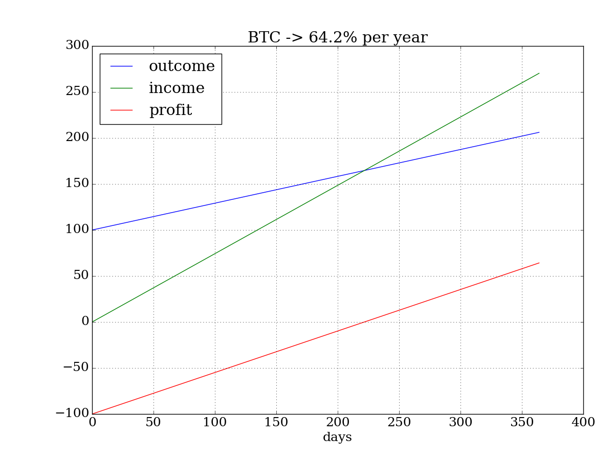

# mining-calc

## Cloud mining profitability vs CPE mining (2017-12-10)


## Profit estimation

Is it cloud mining profitable? Let's investigate what services are proposed now.

I consider 5 cryptocurrencies: Bitcoin, Litecoin, Ethereum, DASH and ZCash. Coins exchange average rates from [coinmarketcap](http://coinmarketcap.com/api/) API at July 16, 2017:

```
$ ./mine2.py

BTC_USD: 1893 USD

ETH: 0.0768 BTC
BTC: 1.0 BTC
DASH: 0.0652 BTC
LTC: 0.02001 BTC
ZEC: 0.07936 BTC
```

Cloud mining proposal consists of the mining cost and maintenance fee for offered hash rate power. I've took the mining price list from Hashflare and Genesis-mining:

```
(investing.yml)
Mining:
    HF:
        BTC:
            mine: 1.2      # USD per 10GH/s
            maint: 0.0035  # USD fee per 10GH/s per day
        LTC:
            mine: 13.5     # USD per 1 MH/s
            maint: 0.01    # USD fee per 1 MH/s per day
        ETH:
            mine: 2.2      # USD per 100 KH/s
            maint: 0       # 1 year contract
        DASH:
            mine: 5.8      # USD per 1 MH/s
            maint: 0       # 1 year contract
        ZEC:
            mine: 2.0      # USD per 0.1 H/s
            maint: 0       # unavailable
    GM:
        BTC:
            mine: 1.5       # USD per 10GH/s
            maint: 0.0028   # USD fee per 10GH/s per day
        LTC:
            mine: 14        # USD per 1 MH/s
            maint: 0        # out of stock
        ETH:
            mine: 2.99      # USD per 100 KH/s
            maint: 0        # 2 years contract
        DASH:
            mine: 6         # USD per 1 MH/s
            maint: 0        # 2 years contract
        ZEC:
            mine: 0.739    # USD per 0.1 H/s
            maint: 0       # out of stock 1 year contract

```

Rewards per offered rate from online calculators:

```
Coins:  # 2017-07-16
    BTC: 0.00000313   # coins per day for 10GH/s
    LTC: 0.00180030   # per 1 MH/s
    ETH: 0.000034775  # per 100 KH/s
    DASH: 0.00010240  # per 1 MH/s
    ZEC: 0.00000297   # per 0.1 H/s

```

The calculation results sorted by annual percent from investment:
```
(report 170716.csv)
currency mining invest  revenue maintenance   profit   return  percent
     ZEC     HF    100  8.12133           0 -91.8787      NaN -91.8787
     ZEC     GM    100  21.9792           0 -78.0208      NaN -78.0208
     ETH     GM    100  61.5553           0 -38.4447      NaN -38.4447
     BTC     HF    100  179.729     106.167  -26.438      NaN  -26.438
     BTC     GM    100  143.783     67.9467 -24.1637      NaN -24.1637
    DASH     GM    100  76.7297           0 -23.2703      NaN -23.2703
    DASH     HF    100  79.3756           0 -20.6244      NaN -20.6244
     ETH     HF    100  83.6592           0 -16.3408      NaN -16.3408
     LTC     HF    100  183.952      26.963  56.9886  7.73333  56.9886
     LTC     GM    100  177.382           0  77.3818  6.86667  77.3818

```
So, the most profitable is LTC mining with return of investment in about 7 month from now (July 16, 2017).


Below is shown calculation graph examples (June 30, 2017) for 100 USD investment for each of considerate currency. The "outcome" line presents our expenses growth per day from 100 USD initial payment for hash rate power. Our revenue presented by "income" line. The "profit" line is the difference between "income" and "outcome". Since the cost for mined coins are higher than maintenance fee, the income is increasing faster that outcome. When income line cross outcome line, the profit changed to positive - it is a point of investment return.

The Ethereum mining have no maintenance fee (it is included to mining cost), but ETH contract is time limited. *Important!* Ethereum blockchain will probably switch from PoW to PoS algorithm till the end of 2017, so mining turned off and investment may not returned. The BTC and LTC contracts are unlimited and could continue to generate profit. Keep in mind that network mining complexity is constantly increasing and hash rate power you've bought will not cover maintenance fee in future. In that case only coins exchange rate growth could compensate your investment.



```
BTC return in 222 days
investing: 100 USD for 364 days
revenue:   270.4 USD
maintance: 106.2 USD
profit:    64.2 USD (64.2 %)
```


### Refuse from responsibility:
Anyway, this is just my small research and not an investing advise.