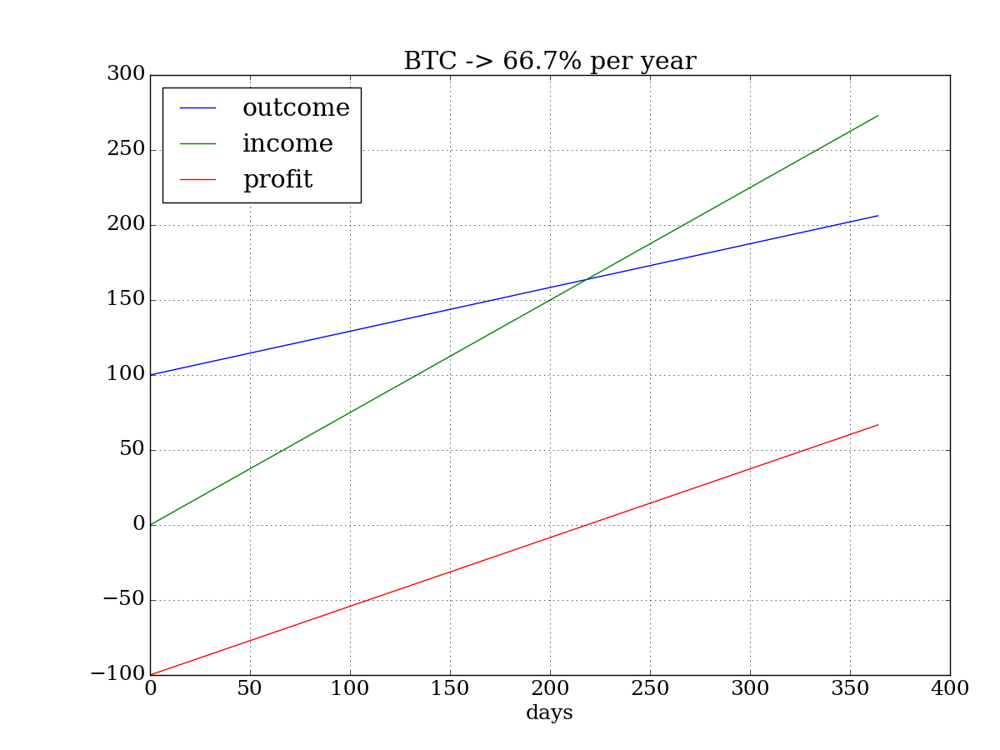
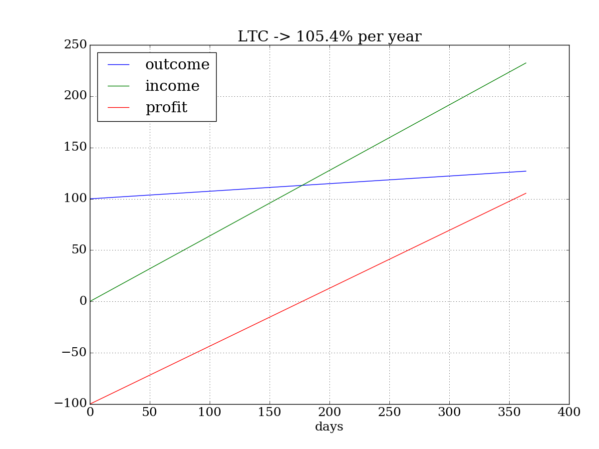
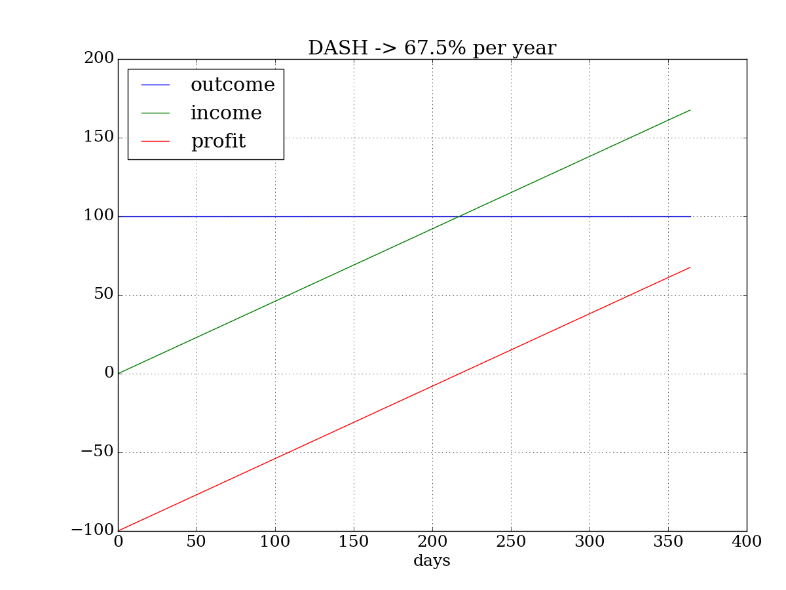

# mining-calc

## Profit estimation for cloud mining

Is it cloud mining profitable? Let's investigate what services are proposed now.

I consider 5 cryptocurrencies: Bitcoin, Litecoin, Ethereum, DASH and ZCash. Coins exchange average rates from [coinmarketcap](http://coinmarketcap.com/api/) API at June 30, 2017:

```
$ ./mine2.py
BTC_USD: 2525.02 USD

LTC: 0.0164672 BTC
ETH: 0.121546 BTC
DASH: 0.0718059 BTC
ZEC: 0.125185 BTC
```

Cloud mining proposal consists of the mining cost and maintenance fee for offered hash rate power. I've took the mining price list from hashflare.io and the rewards per offered rate from online calculators:

```
            "BTC": 
                "mining": # https://alloscomp.com/bitcoin/calculator
                    {
                    "MINE" : 1.2,          # USD per 10GH/s
                    "MAINT" : 0.0035,      # USD fee per 10GH/s per day
                    "COINS" : 353 * 1e-8,  # coins per day for 10GH/s for current difficulty
                    }
            "LTC": 
                 "mining": # http://www.coinwarz.com/calculators/litecoin-mining-calculator/
                     {
                     "MINE" : 13.5,       # USD per 1 MH/s
                     "MAINT" : 0.01,      # USD fee per 1 MH/s per day
                     "COINS" : 0.002067,  # coins per day for 1 MH/s
                     }
            "ETH": 
                 "mining": # https://etherscan.io/ether-mining-calculator
                     {
                     "MINE" : 2.2,            # USD per 100 KH/s
                     "MAINT" : 0,             # zero fee
                     "COINS" : 4.3849 * 1e-5, # coins per day for 100 KH/s
                     }
```

Below is shown calculation graph examples for 100 USD investment for each of considerate currency. The "outcome" line presents our expenses growth per day from 100 USD initial payment for hash rate power. Our revenue presented by "income" line. The "profit" line is the difference between "income" and "outcome". Since the cost for mined coins are higher than maintenance fee, the income is increasing faster that outcome. When income line cross outcome line, the profit changed to positive - it is a point of investment return.

The Ethereum looks more profitable now and have no maintenance fee, but ETH contract is limited to only 1 year. Important! Ethereum blockchain will probably switch from PoW to PoS algorithm till the end of 2017, so mining turned off and investment may not returned. The BTC and LTC contracts are unlimited and will continue to generate profit. Keep in mind that network mining complexity is constantly increasing and hash rate power you've bought will not cover maintenance fee in future. In that case only coins exchange rate growth could compensate your investment.



```
BTC return in 222 days
investing: 100 USD for 364 days
revenue:   270.4 USD
maintance: 106.2 USD
profit:    64.2 USD (64.2 %)
```



```
LTC return in 178 days
investing: 100 USD for 364 days
revenue:   231.7 USD
maintance: 27.0 USD
profit:    104.8 USD (104.8 %)
```


```
ETH return in 164 days
investing: 100 USD for 364 days
revenue:   222.7 USD
maintance: 0.0 USD
profit:    122.7 USD (122.7 %)
```


```
DASH return in 242 days
investing: 100 USD for 364 days
revenue:   150.8 USD
maintance: 0.0 USD
profit:    50.8 USD (50.8 %)
```


```
ZEC
investing: 100 USD for 364 days
revenue:   14.8 USD
maintance: 0.0 USD
profit:    -85.2 USD (-85.2 %)
```

Anyway, this is just my small research and not an investing recommendation. Who knows what the price will be in a year?